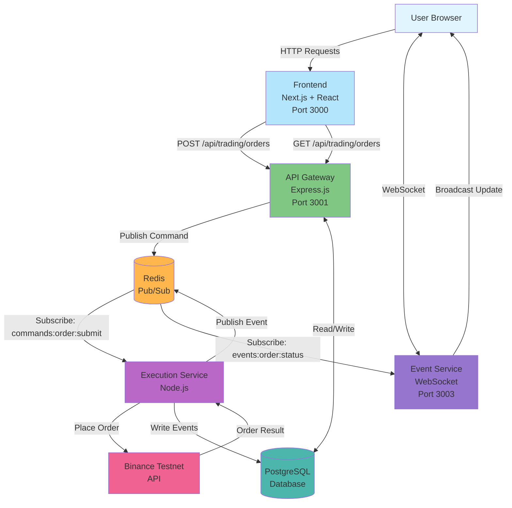

# Trading Platform - Full Stack Assignment

A production-ready cryptocurrency trading platform with microservices architecture, real-time order execution, and WebSocket-based updates.

## Live Demo

- **Frontend:** https://numatix-trading-platform.vercel.app
- **Backend API:** https://backend-production-6024.up.railway.app
- **WebSocket Service:** https://event-service-production-2497.up.railway.app

## Demo Video

[Add YouTube link here after recording]

## Architecture

### System Design - Data Flow Diagram




### System Design

```
Frontend (Next.js)
    |
    v
API Gateway (Express)
    |
    v
Redis Pub/Sub
    |
    +----+----+
    |         |
    v         v
Execution  Event
Service    Service
    |         |
    v         v
Binance   WebSocket
```

## Order Flow

1. User places order -> API Gateway
2. Gateway publishes -> Redis (commands:order:submit)
3. Execution Service subscribes -> Executes on Binance
4. Result published -> Redis (events:order:status)
5. Event Service broadcasts -> WebSocket to client
6. Frontend updates in real-time

## Tech Stack

- **Backend:** Node.js, Express, TypeScript
- **Database:** PostgreSQL + Prisma ORM
- **Cache:** Redis (Pub/Sub)
- **Frontend:** Next.js 15, React, Tailwind CSS
- **Hosting:** Railway (backend), Vercel (frontend)
- **Security:** AES-256-GCM encryption, JWT

## Known Limitations

**Binance API Geo-Blocking:** Railway servers are blocked by Binance geo-restrictions.

**Architecture Validation:**
- Complete order flow works (tested locally)
- Redis pub/sub functioning correctly
- WebSocket real-time updates working
- All microservices communicating properly

**Production Solution:** Use approved server regions or proxy service.

## Local Development

```bash
# Clone and install
git clone <repo-url>
npm install

# Setup environment - copy .env.example files in each service directory

# Start Redis
docker run -d -p 6379:6379 redis

# Migrate database
cd packages/database
npx prisma migrate dev

# Start services (open 4 terminals)
npm run dev:backend
npm run dev:execution
npm run dev:event
npm run dev:frontend
```

Visit http://localhost:3000

## Project Structure

```
apps/
├── backend/           # API Gateway (Port 3001)
├── execution-service/ # Order execution (background)
├── event-service/     # WebSocket server (Port 3003)
└── frontend/          # Next.js app (Port 3000)

packages/
├── database/          # Prisma schema
└── shared/            # Shared TypeScript types
```

## Key Features

- JWT authentication
- Encrypted Binance API key storage (AES-256-GCM)
- Redis pub/sub event architecture
- Real-time WebSocket updates
- Order execution with Binance Testnet
- Position tracking from filled orders
- Responsive UI with Tailwind CSS

## Security

- AES-256-GCM encryption for API keys at rest
- JWT tokens for authentication
- Input validation with Zod schemas
- CORS configuration
- Environment variable secrets

## Database Schema

- **User:** Email, password hash, encrypted Binance keys
- **OrderCommand:** Order intent with status tracking
- **OrderEvent:** Execution results from Binance

## Design Decisions

1. **Monorepo:** Shared types, easier development
2. **Redis Pub/Sub:** Simple, scalable event bus
3. **Microservices:** Independent scaling, separation of concerns
4. **PostgreSQL:** ACID compliance, relational data
5. **Custom Chart:** Lightweight, SSR-compatible

## LLM Usage

GitHub Copilot used for code assistance and architecture guidance.

## Author

**Meraj** - December 24, 2025

## Acknowledgments

Numatix for the opportunity | Binance Testnet API
